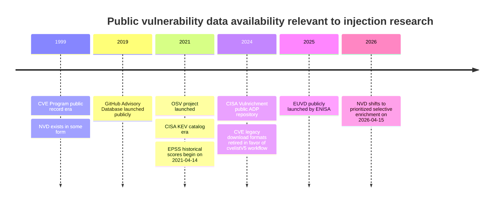

# Vulnerability Databases for Injection Prevention Research

## Executive summary

For a historical, reproducible, prevention-oriented paper on injection vulnerabilities, the highest-value public backbone is a layered corpus built from the official CVE corpus first, then enriched selectively: use **MITRE CVE List V5** as the canonical identifier and disclosure record, **NVD** for normalized CWE/CPE/CVSS/CVE change history when available, **CISA Vulnrichment** to backfill post-2024 enrichment gaps, **CISA KEV** for confirmed exploitation, **EPSS** for exploit-likelihood signals, **Exploit-DB** for public PoC linkage, and **GHSA/OSV** for package-accurate affected-version and fix-range data in open-source ecosystems. That combination maximizes recall, preserves provenance, and remains mostly reproducible without proprietary dependencies. citeturn24view3turn21view0turn28view0turn24view4turn24view5turn36search1turn26view2turn26view0

The central caveat in 2026 is that **NVD is no longer enriching every CVE**. NIST announced that, starting April 15, 2026, NVD enrichment is prioritized for KEV-listed CVEs, software used by the U.S. federal government, and EO 14028 critical software; lower-priority CVEs remain present in NVD but may lack NVD-supplied CWE, CPE, or CVSS enrichment. Any paper that treats NVD enrichment as uniformly complete across years will now be biased, especially for recent long-tail CVEs. citeturn28view2turn13search5turn13search13

For an **injection prevention** paper, the best structure is not to treat “injection” as one flat class. A stronger approach is a hierarchical label system anchored in CWE: a coarse superclass rooted in **CWE-74 Injection**, then more prevention-relevant groups such as **query/data-store injection** such as SQL or query logic, **command/process invocation injection**, **output/rendering injection** such as XSS or CRLF/header splitting, and **code/expression/template injection**. That organization maps much more cleanly to preventive controls such as parameterization, context-sensitive output encoding, strict allowlisting, parser isolation, and safe API selection. citeturn37search0turn37search13turn37search16turn37search19

Academic datasets are useful, but mostly as **supplemental fix/patch corpora**, not as the main census of injection CVEs. **CVEfixes** is the best general-purpose bridge from CVEs to fix commits and relational analysis; **Big-Vul**, **DiverseVul**, **MegaVul**, and **MoreFixes** are valuable for code-level studies, but they are biased toward open-source repositories, languages with good repository mining coverage, and CVEs that can be linked to commits. They should support qualitative and code-level prevention analysis, not replace the official CVE record backbone. citeturn11search2turn12search5turn11search4turn11search5turn11search15turn11search10

## Prioritized inventory of databases

### Core official and public sources

| Priority | Source | Category | Access method | Formats | Update frequency | Coverage period | Licensing or restrictions | Registration or fees | Why it matters |
|---|---|---|---|---|---|---|---|---|---|
| Highest | MITRE CVE List V5 citeturn24view3turn15search3turn20view1 | Official primary | Git clone, GitHub releases zip, web downloads | CVE JSON 5.0/5.1 | Updated about every 7 minutes in the GitHub cache repo; daily baseline and hourly delta zip releases | 1999–present; CVE.org reports over 347,000 accessible CVE Records | Use governed by CVE Program Terms of Use | No fee; no registration needed for GitHub access | Canonical CVE identity, CNA/ADP provenance, affected versions, references, timeline metadata |
| Highest | NVD API and JSON 2.0 feeds citeturn21view0turn24view0turn24view2turn20view0 | Official enrichment | REST API, JSON 2.0 bulk feeds, web UI | JSON 2.0 | Year feeds daily; recent/modified feeds every 2 hours | NVD docs state it has existed since 1999 and currently contains 365,122 CVE records | U.S. government public data terms; use subject to NVD site terms | API key optional; no fee; unauthenticated rate limit 5 requests per 30 seconds, 50 with key | Best public source for standardized CWE/CPE/CVSS and change-history enrichment |
| High | CISA Vulnrichment citeturn28view0 | Official U.S. ADP enrichment | GitHub repo; CVE ADP containers in downstream CVE records | CVE JSON with ADP containers | Active development; repo updated continuously | Public repo contains CVEs from 2018–2026 folders; current effort focuses on new and recent CVEs | CC0-1.0 repo license | No fee; no registration required for public repo | Best current backfill for CWE/CVSS/SSVC on CVEs not fully enriched by NVD |
| High | CISA KEV catalog / `kev-data` mirror citeturn24view4turn25view0turn25view1 | Official exploitation subset | CISA web UI, JSON, CSV, JSON Schema, GitHub mirror | JSON, CSV, JSON Schema | Updated when catalog changes, typically weekdays during U.S. business hours; GitHub mirror synced within minutes | Catalog era 2021–present | CC0 license on `kev-data` mirror | No fee; no registration | High-precision signal for active exploitation in the wild |
| High | CWE citeturn14search2turn23view0turn23view1 | Official weakness taxonomy | Downloads page, web UI | XML zip, CSV zip, HTML/booklet | Periodic versioned releases; exact live cadence unspecified | Long-running taxonomy; exact start not specified on current downloads page | MITRE usage terms apply | No fee; no registration | Required to normalize weakness labels and build hierarchical injection classes |
| High | EPSS citeturn24view5turn24view6 | Official scoring model from FIRST | REST API, daily CSV, historical GitHub repo | JSON API, CSV, CSV.gz | Daily | Historic scores available from 2021-04-14 onward | Publicly downloadable; specific redistribution terms not foregrounded on the cited pages | No fee; no registration | Best open exploit-likelihood signal for longitudinal prioritization |
| High | Exploit-DB / SearchSploit citeturn10search0turn36search1turn10search2 | Public PoC and exploit archive | Git clone, local offline SearchSploit, web UI | Source files, CSV metadata, local JSON output from `searchsploit -j` | Daily package or Git updates; Kali package typically weekly | Historical public exploit archive; exact formal start year unspecified in cited docs | GPL-2.0-or-later repo license | No fee; no registration to clone | Best public PoC linkage layer; useful for exploit-evidence and patch-timing studies |

### High-value ecosystem, vendor, and supplementary sources

| Priority | Source | Category | Access method | Formats | Update frequency | Coverage period | Licensing or restrictions | Registration or fees | Why it matters |
|---|---|---|---|---|---|---|---|---|---|
| High | GitHub Advisory Database citeturn26view2turn20view3turn27view0turn27view2 | Public package advisory DB | Web UI, REST API, GraphQL API, git repo clone | OSV JSON, REST JSON | Continuously curated; EPSS synchronized daily | Public database launched in 2019; historical advisory coverage extends further through imported sources | CC-BY-4.0 | REST access can be unauthenticated for public resources; no fee for public data | Strong for OSS package ranges, fixed versions, ecosystems, EPSS, and CVE aliases |
| High | OSV.dev citeturn26view0turn26view3turn20view2 | Public OSS vulnerability aggregator | REST API, GCS bulk dumps, web UI | OSV JSON, zip, CSV index of modified IDs | Continuous export and continuous updates | Project launched in 2021; includes historical advisories imported from multiple home databases | Upstream-source-specific licensing varies; current docs do not present one universal data license for all imported records | No fee; no registration for public API/dumps | Best for precise version ranges, package ecosystems, and commit-hash/package-version queries |
| Medium | Red Hat Security Data API citeturn17search17turn29view1turn29view0 | Vendor advisory / package fix states | REST API, web UI | JSON, XML, HTML, CSAF, OVAL, OSV, VEX | Current and historical feeds; exact cadence unspecified | Historical archive; exact start unspecified on cited docs | CC-BY-4.0 for the linked resources and API representations | No fee; registration unspecified in cited docs | Excellent for vendor-confirmed affected products, fix states, CSAF/VEX, package-state analysis |
| Medium | Microsoft Security Updates / MSRC CVRF API citeturn17search2turn28view3turn28view4 | Vendor advisory / patch data | REST API, PowerShell module, web guide | JSON via CVRF API, OpenAPI, PowerShell objects | Current monthly update cadence plus historical access; exact endpoint cadence unspecified | Historical Microsoft security update archive; exact start unspecified in cited docs | Terms not specified on cited API pages | Authentication/API-key requirement for CVRF API was removed in 2021; no fee stated | Useful for patch/remediation timelines, exploitability index, and Microsoft-product injection CVEs |
| Medium | Cisco PSIRT openVuln API citeturn20view5turn30view0turn30view4 | Vendor advisory / product-specific exposure | REST API, API console | JSON, XML, CSAF/CVRF URLs in responses | Current advisory service; exact cadence unspecified | Historical Cisco advisories; exact start unspecified | Access terms not specified in cited docs | Bearer-token API; Cisco DevNet/API console workflow implied | Strong for appliance/network product affected-version and advisory correlation |
| Medium | Debian Security Tracker citeturn28view5turn28view6 | Distribution package security DB | Web UI, JSON feed, tracker redirects | JSON, HTML, OVAL via Debian security pages | Continuously maintained | Historical Debian security archive; exact start unspecified in cited docs | Debian site/licensing terms apply | No fee; no registration | High-value for package-level fix states and distro-specific impact |
| Medium | Vulnerability-Lookup by CIRCL citeturn20view6turn19search15turn19search1 | Public multi-source aggregator | REST API, dumps, web UI, RSS/Atom | JSON, feeds | Continuous multi-source ingestion | Modern platform; aggregates multiple sources including CVE, NVD, GitHub, KEV | AGPL-3.0 software license; per-source data terms still matter | No fee for public instance | Useful as a correlation layer, not as an authoritative primary source |
| Medium | EUVD citeturn6search11turn6search15 | Official EU database | Web UI; API endpoint publicly referenced by third-party integration documentation | JSON API implied; UI | Current operational service | Public EUVD visible in 2025–2026; historical depth on current docs is unspecified | Restrictions unspecified in accessible cited docs | No fee/public registration requirements not specified | Emerging official EU-level complement, especially for European CVD and exploited/critical dashboards |

### Commercial and research-accessible paid sources

| Priority | Source | Category | Access method | Formats | Update frequency | Coverage period | Licensing or restrictions | Registration or fees | Research use |
|---|---|---|---|---|---|---|---|---|---|
| Medium | VulDB citeturn5search15turn5search4 | Commercial vulnerability intelligence | API, web UI, exports depending plan | JSON/API and web | Continuously maintained; exact cadence unspecified | Historical corpus; exact start unspecified | Proprietary commercial terms | Public entry plan shown; higher tiers paid | Useful for breadth and alternate enrichment, but reproducibility is weaker |
| Medium | Vulners citeturn5search1turn5search8 | Commercial/research API platform | API, web UI | JSON/API | Current service; exact cadence unspecified | Historical archive; exact start unspecified | Proprietary terms | Paid API plans publicly listed | Good for operational querying and exploit/advisory aggregation; weak for open reproducibility |
| Medium | Flashpoint VulnDB citeturn5search7 | Commercial research dataset | API/platform access | Proprietary structured feeds | Current service; exact cadence unspecified | Historical archive; exact start unspecified | Proprietary enterprise terms | Quote-based / fee unspecified publicly on cited page | High-value proprietary enrichment; poor reproducibility for academic replication |

### Academic and code-linked research datasets

| Priority | Dataset | What it adds | Access | Data format | Coverage period | Licensing | Known use |
|---|---|---|---|---|---|---|---|
| High | CVEfixes citeturn11search2turn12search5turn12search1 | CVE-to-fix-commit linkage in a relational dataset mined from NVD and OSS repositories | GitHub, Zenodo | Relational DB / dataset release | Historical OSS CVEs; exact date span varies by release | Licensing not clearly stated in the cited summary pages | Best academic bridge from CVEs to fixes and patches |
| Medium | Big-Vul citeturn11search0turn11search4turn11search12 | Vulnerable and fixed code changes with CVE summaries | GitHub / paper | CSV | 2002–2019 | Licensing unspecified in cited pages | Good for code-level prevention patterns in C/C++ |
| Medium | DiverseVul citeturn11search5turn11search9 | Larger vulnerable function corpus across many CWEs | GitHub / paper | Dataset files; published paper | Vulnerabilities extracted from 7,514 commits; paper reports 18,945 vulnerable functions | Licensing unspecified in cited pages | Better scale/diversity than older code-only datasets |
| Medium | MegaVul citeturn11search3turn11search15 | Large function-level C/C++/Java vulnerability set with code representations | GitHub / paper | JSON | January 2006–October 2023 | Repo/paper say dataset available on GitHub; exact data license should be checked per release | Useful for code representation studies, less useful as a whole-CVE census |
| Medium | MoreFixes citeturn11search10 | Large-scale CVE fix-commit mining with 2026 release | GitHub / Zenodo | Dataset + patches | Release-specific; historical mined fixes | Refer to release; exact license unspecified in cited snippet | Good for patch-mining and commit-based enrichment |

## Source-by-source field coverage, quality, and gaps

### Official CVE and NVD family

**MITRE CVE List V5** is the canonical record layer. The official schema supports rich fields including CVE ID and core metadata, CNA and ADP provider metadata, affected products and versions, public references, problem types with optional CWE IDs, metrics including CVSS, version semantics, code-file and routine pointers when provided, and researcher/remediation credits. In practice, this means it is the best provenance-preserving source for “what the assigning authority or authorized publisher actually said,” but not the best source for uniform normalization, because many fields remain optional and population depth varies by CNA and ADP. citeturn20view1turn21view5turn22view0turn23view0turn23view2turn23view3turn23view4

The largest quality issue in the MITRE corpus is **heterogeneity** rather than incorrectness. The schema allows rich detail, but contributions come from many CNAs with uneven practices. Some records have precise affected version ranges and CWE IDs; others provide only a short description and references. The cvelistV5 repository also records known issues, including date inconsistencies in older records that the CVE Program says were corrected in September 2024. For a historical paper, treat MITRE as authoritative for identity and source provenance, but not as a uniform feature matrix. citeturn24view3turn20view1

**NVD** remains the strongest open normalization layer because it adds standardized CPE applicability statements, CWE mapping, CVSS metrics, reference tags, and change history. It also exposes bulk year/recent/modified feeds and a CVE change-history API, which is unusually useful for reconstructing when enrichment appeared, changed, or was remapped. Earlier NVD records are less detailed, and NVD explicitly warns that pre-2015 entries often have substantially lower fidelity than recent ones. citeturn21view0turn21view4turn24view0

The decisive 2026 NVD gap is **selective enrichment**. NIST now prioritizes enrichment for KEV, federal software, and EO 14028 critical software, and lower-priority CVEs may remain in NVD with “Not Scheduled” status and without immediate NVD-supplied enrichment. NIST also states it will no longer routinely provide a separate NVD severity score when the CNA already supplied one. For any post-April-2026 historical slice, missing NVD CWE/CPE/CVSS is now partly a workflow artifact, not evidence that a CVE lacks those properties. citeturn28view2turn13search5turn13search13

### CISA exploitation and enrichment layers

**CISA Vulnrichment** is the most important public counterweight to recent NVD incompleteness. CISA describes it as public enrichment of CVE records via the ADP container, initially adding SSVC decision points and, for some higher-risk CVEs, CWE and CVSS where possible. CISA explicitly states that it does **not overwrite the originating CNA’s data**. This makes Vulnrichment ideal for backfilling recent CVEs while preserving source separation between CNA claims and CISA-added analysis. citeturn28view0

The main quality issue in Vulnrichment is **coverage selectivity and evolving process**. CISA says some higher-risk CVEs receive additional CWE/CVSS enrichment, but not all CVEs do. The project is also under active development, which is good for freshness but means a paper should pin a repository snapshot or date-stamped export for reproducibility. Public issue traffic around discrepancies also shows that, like all enrichment efforts, Vulnrichment can contain field-level disagreements that later get corrected. citeturn28view0turn9search9

**CISA KEV** is a different kind of source: it is not a general vulnerability database, but a curated exploited subset with operational fields such as remediation action and due date. For prioritization studies it is extremely high value, because active exploitation status is rare, expensive ground truth. For representativeness, however, it has low recall by design and should never be used as a stand-in for all “dangerous” or all “in-the-wild” injection CVEs. It is a high-precision exploitation label, not a census. citeturn24view4turn25view0turn18search5

### Exploit, risk, and package-ecosystem sources

**EPSS** contributes only a few fields—CVE, probability, percentile, and time series—but those fields are analytically powerful. Historic scores are available only from **2021-04-14** onward, and EPSS model changes matter: FIRST notes a major shift when EPSS v2 started publishing on **2022-02-04**. Any time-series paper should therefore version-control the EPSS model date and avoid treating pre- and post-model-change scores as directly identical distributions. citeturn24view5turn24view6

**Exploit-DB** is the best public layer for PoC linkage. The GitLab repository is the official mirror, SearchSploit can search by CVE, and the local CSV metadata files contain exploit metadata such as EDB-ID and publication information. The critical limitation is that CVE linkage is **incomplete and imperfect**: some exploits have explicit CVE codes visible through SearchSploit; others do not, and metadata richness can differ between the local repository and the website. There is also a documented CSV formatting issue in `files_exploits.csv`, so parsers should be robust rather than naive. citeturn10search0turn36search1turn10search2

**GitHub Advisory Database** and **OSV** are essential for open-source package ecosystems. GitHub’s database is large, free, community-curated, OSV-formatted, queryable over web/UI/REST/GraphQL, and can surface CVEs, CWEs, vulnerable and patched versions, ecosystems, EPSS, CVSS, references, and credits. OSV adds a strong machine-oriented schema centered on precise affected versions and commit hashes, plus public bulk dumps. Both are much better than NVD for package-level version precision in open-source dependency studies. citeturn26view2turn20view3turn27view0turn26view0turn26view3

Their main gap is **scope bias**. GitHub and OSV are oriented to open-source and package ecosystems. That makes them excellent for injection vulnerabilities in libraries, frameworks, and dependency graphs, but less representative for embedded devices, enterprise appliances, locally installed proprietary software, and vendor-only products. That is an inference from the documented ecosystem coverage and source lists, and it is exactly why they work best as enrichments on top of a CVE-wide backbone rather than as the sole corpus. citeturn26view0turn26view2turn26view3

### Vendor advisories and distribution trackers

Vendor and distribution sources are the best path to **patch state, product impact, and fix timing**. Red Hat publishes CVE, CSAF, OVAL, OSV, and VEX-related data with explicit API support and CC-BY licensing. Microsoft provides programmatic access through the Security Update Guide / CVRF API and has removed the prior authentication requirement for public consumption of the CVRF API. Cisco’s openVuln API returns advisory information in machine-readable formats and includes CVE, CVE/CWE/CVSS, publication times, and links to CSAF/CVRF. Debian’s Security Tracker publishes JSON with package-specific status and points to related DSAs, DLAs, and OVAL files. citeturn17search17turn29view1turn29view0turn17search2turn28view4turn20view5turn30view0turn28view5turn28view6

The quality problem with vendor sources is not lack of detail; it is **fragmentation and incomparable semantics**. Each vendor uses different product naming, version notation, fixed-state language, and advisory granularity. Red Hat’s package state vocabulary, Debian’s tracker statuses, Microsoft’s update-guide structure, and Cisco’s advisory schema do not align out of the box. This is fixable with normalization, but it must be explicit in the paper. citeturn29view0turn29view3turn28view5turn20view5

### Academic code-linked datasets

**CVEfixes** is the best direct academic extension of a CVE-centric workflow because it was designed to automatically collect vulnerabilities from NVD and organize vulnerable code plus fixes in a relational database. For a prevention paper, it is the strongest source for linking injection CVEs to actual code changes and fix patterns. citeturn11search2turn12search5turn12search21

**Big-Vul**, **DiverseVul**, **MegaVul**, and **MoreFixes** all help answer questions that the official CVE databases cannot, especially about code patterns and remediation. Big-Vul covers 3,754 C/C++ vulnerabilities from 348 GitHub projects across 2002–2019; DiverseVul reports 18,945 vulnerable functions and 330,492 non-vulnerable functions from 7,514 commits spanning 150 CWEs; MegaVul reports 17,380 vulnerabilities from 992 repositories spanning January 2006 to October 2023; MoreFixes emphasizes larger-scale CVE fix-commit mining with a 2026 release. These are strong supplements for patch-level clustering, but weak substitutes for corpus-wide vulnerability counting because they filter toward what can be mined from public repositories. citeturn11search12turn11search5turn11search15turn11search10

## Acquisition endpoints and sample collection workflows

### API and bulk endpoints to cite

| Source | API or bulk endpoint |
|---|---|
| NVD CVE API | `https://services.nvd.nist.gov/rest/json/cves/2.0` |
| NVD Change History API | `https://services.nvd.nist.gov/rest/json/cvehistory/2.0` |
| NVD CPE Match API | `https://services.nvd.nist.gov/rest/json/cpematch/2.0` |
| NVD JSON 2.0 feeds page | `https://nvd.nist.gov/vuln/data-feeds` |
| CVE List downloads | `https://www.cve.org/downloads` |
| CVE List V5 repo | `https://github.com/CVEProject/cvelistV5` |
| CVE JSON schema docs | `https://cveproject.github.io/cve-schema/schema/docs/` |
| CISA KEV JSON mirror | `https://raw.githubusercontent.com/cisagov/kev-data/develop/known_exploited_vulnerabilities.json` |
| CISA KEV CSV mirror | `https://raw.githubusercontent.com/cisagov/kev-data/develop/known_exploited_vulnerabilities.csv` |
| CISA KEV schema | `https://raw.githubusercontent.com/cisagov/kev-data/develop/known_exploited_vulnerabilities_schema.json` |
| CISA Vulnrichment repo | `https://github.com/cisagov/vulnrichment` |
| CWE downloads | `https://cwe.mitre.org/data/downloads.html` |
| FIRST EPSS API | `https://api.first.org/data/v1/epss` |
| FIRST EPSS daily bulk CSV | `https://epss.empiricalsecurity.com/epss_scores-YYYY-MM-DD.csv.gz` |
| EPSS historical repo | `https://github.com/empiricalsec/epss_scores` |
| Exploit-DB repo | `https://gitlab.com/exploit-database/exploitdb.git` |
| GitHub Advisory REST | `https://api.github.com/advisories` |
| GitHub Advisory repo | `https://github.com/github/advisory-database` |
| OSV API | `https://api.osv.dev/v1/query` |
| OSV bulk all.zip | `https://storage.googleapis.com/osv-vulnerabilities/all.zip` |
| Red Hat CVE API | `https://access.redhat.com/hydra/rest/securitydata/cve.json` |
| Red Hat CSAF API | `https://access.redhat.com/hydra/rest/securitydata/csaf.json` |
| Debian Security Tracker JSON | `https://security-tracker.debian.org/tracker/data/json` |

The endpoints above are all documented or directly referenced by the corresponding official documentation or official project repositories. citeturn21view0turn21view4turn24view1turn24view0turn24view3turn24view4turn28view0turn14search2turn24view5turn24view6turn36search1turn27view0turn26view2turn26view0turn26view3turn29view0turn29view1turn28view5

### Sample collection commands

A minimal **NVD historical collection** approach is to page by modification date and persist the change history separately so later remaps are visible.

```bash
# NVD CVEs modified in a 120-day window
curl -sG 'https://services.nvd.nist.gov/rest/json/cves/2.0' \
  --data-urlencode 'lastModStartDate=2025-01-01T00:00:00.000Z' \
  --data-urlencode 'lastModEndDate=2025-04-30T23:59:59.999Z' \
  --data-urlencode 'resultsPerPage=2000' \
  --data-urlencode 'startIndex=0' \
  -H 'apiKey: YOUR_NVD_API_KEY'

# NVD change history for one CVE
curl -sG 'https://services.nvd.nist.gov/rest/json/cvehistory/2.0' \
  --data-urlencode 'cveId=CVE-2024-12345'
```

This is aligned with NVD’s documented base URLs, pagination model, and 120-day maximum date-range constraint for date-based queries. citeturn21view0turn20view0

A minimal **official CVE corpus pull** is easiest through `git`, not screen scraping.

```bash
git clone https://github.com/CVEProject/cvelistV5.git
cd cvelistV5
git pull
```

That mirrors the officially recommended update path for cvelistV5; the repo also provides daily baseline and hourly delta zip releases if you want immutable snapshots instead of a moving Git head. citeturn24view3

A minimal **KEV + EPSS enrichment** collection can be done as follows.

```bash
curl -L \
  'https://raw.githubusercontent.com/cisagov/kev-data/develop/known_exploited_vulnerabilities.json' \
  -o kev.json

curl -sG 'https://api.first.org/data/v1/epss' \
  --data-urlencode 'cve=CVE-2024-12345,CVE-2024-23456'

curl -L \
  'https://epss.empiricalsecurity.com/epss_scores-2026-07-01.csv.gz' \
  -o epss_scores-2026-07-01.csv.gz
```

CISA documents the KEV mirror and FIRST documents both the EPSS API and the date-addressable daily full CSV downloads. citeturn24view4turn24view5turn24view6

For **GitHub Advisory Database**, REST is easier than GraphQL for paper-quality reproducibility.

```bash
curl -L \
  -H 'Accept: application/vnd.github+json' \
  -H 'X-GitHub-Api-Version: 2026-03-10' \
  'https://api.github.com/advisories?cve_id=CVE-2024-12345'

curl -L \
  -H 'Accept: application/vnd.github+json' \
  -H 'X-GitHub-Api-Version: 2026-03-10' \
  'https://api.github.com/advisories?cwes=74,77,78,79,89,93,94&severity=high'
```

GitHub documents that the public endpoint can be used without authentication for public resources and supports direct filtering by CVE, CWE, ecosystem, severity, EPSS, and dates. citeturn27view0

For **OSV**, use package-version or commit-hash queries, then fall back to bulk dumps for large-scale offline work.

```bash
curl -s \
  -d '{"version":"3.1.4","package":{"name":"jinja2","ecosystem":"PyPI"}}' \
  'https://api.osv.dev/v1/query'

curl -s \
  -d '{"commit":"6879efc2c1596d11a6a6ad296f80063b558d5e0f"}' \
  'https://api.osv.dev/v1/query'
```

OSV explicitly supports both query styles and offers full-database and per-ecosystem bulk dumps for offline analysis. citeturn26view3turn26view0

For **Exploit-DB**, clone the repo and use SearchSploit to extract CVE-linked results in a structured offline way.

```bash
git clone https://gitlab.com/exploit-database/exploitdb.git /opt/exploitdb
/opt/exploitdb/searchsploit --cve 2021-44228
/opt/exploitdb/searchsploit -j --cve 2021-44228 > edb_cve_2021_44228.json
```

SearchSploit’s official manual documents local cloning, offline searching, JSON output mode, and CVE-based search. citeturn36search1

### Python-style ingestion pseudocode

```python
from pathlib import Path
import json
import gzip
import csv

def load_cvelist(repo_root: Path):
    for path in repo_root.rglob("CVE-*.json"):
        rec = json.loads(path.read_text())
        yield {
            "record_source": "mitre_cvelistv5",
            "cve_id": rec["cveMetadata"]["cveId"],
            "published_at": rec["cveMetadata"].get("datePublished"),
            "updated_at": rec["cveMetadata"].get("dateUpdated"),
            "assigner": rec["cveMetadata"].get("assignerShortName"),
            "raw": rec,
        }

def merge_nvd_enrichment(base, nvd_record):
    # normalize cwe, cvss, cpe, reference tags, lastModified
    pass

def merge_vulnrichment(base, adp_record):
    # preserve source-specific provenance; do not overwrite CNA fields
    pass

def merge_kev(base, kev_row):
    base["is_kev"] = True
    base["kev_date_added"] = kev_row["dateAdded"]
    base["kev_required_action"] = kev_row["requiredAction"]
    return base

def merge_epss(base, epss_row):
    base["epss"] = float(epss_row["epss"])
    base["epss_percentile"] = float(epss_row["percentile"])
    return base

def link_osv_ghsa(base, advisories):
    # add package ecosystems, vulnerable ranges, fixed versions, aliases
    pass

def link_exploitdb(base, edb_matches):
    # attach PoC indicators and URLs/hashes, not executables
    pass
```

The key design rule is source separation: keep CNA, ADP, NVD, vendor, EPSS, KEV, OSV/GHSA, and Exploit-DB fields in separate namespaces before producing any fused analysis table. That preserves provenance and makes later disagreement analysis possible. The need for this follows directly from the separate CNA and ADP containers in CVE JSON plus NVD and vendor-specific enrichment layers. citeturn24view3turn23view3turn28view0turn21view4

### SQL-style examples for historical analysis

```sql
-- CVEs whose normalized injection family is SQL/query injection
SELECT cve_id, published_at, cwe_primary, cvss_v31_base, epss, is_kev
FROM vuln_normalized
WHERE injection_family = 'query_injection'
ORDER BY published_at;

-- CVEs with public exploit signal and vendor fix metadata
SELECT cve_id, exploitdb_count, epss, is_kev, vendor_fix_state, first_patch_date
FROM vuln_normalized
WHERE exploitdb_count > 0
ORDER BY epss DESC;

-- Recent CVEs with missing NVD enrichment but present CISA ADP enrichment
SELECT cve_id, published_at, nvd_cwe, adp_cwe, nvd_cvss_v31, adp_cvss_v31
FROM vuln_normalized
WHERE published_at >= '2026-04-15'
  AND nvd_cwe IS NULL
  AND adp_cwe IS NOT NULL;
```

The third query is particularly important after the April 15, 2026 NVD policy change. citeturn28view2

## Preprocessing, normalization, and labeling for injection research

### Recommended normalization schema

| Canonical field | Preferred source order | Notes |
|---|---|---|
| `cve_id` | MITRE CVE List V5 → NVD | Use MITRE as canonical ID authority |
| `description` | CNA description → NVD description → vendor advisory summary | Preserve original text and a normalized copy |
| `published_at` | CVE metadata `datePublished` → NVD publish date → vendor disclosure date | Keep all raw timestamps separately |
| `updated_at` | CVE metadata `dateUpdated` → NVD last modified → source-specific update times | Needed for longitudinal reconstruction |
| `cwe_primary` | CNA/ADP problemTypes → NVD weakness mapping → vendor advisory → text classifier fallback | Keep all candidate CWEs, not just one |
| `cvss_v4`, `cvss_v31`, `cvss_v2` | CNA/ADP → NVD → vendor advisory | Preserve source of score; do not silently merge |
| `affected_products` | MITRE affected → NVD CPE/configurations → vendor advisories → GHSA/OSV packages | Normalize to separate product/package tables |
| `affected_versions` | MITRE affected versions → GHSA/OSV ranges → vendor fix states | Capture exact range semantics and source |
| `references` | All sources, deduplicated by normalized URL | Keep source tags and reference types |
| `exploit_signals` | KEV, EPSS, Exploit-DB, GitHub/OSV references, vendor exploitability index | Model as separate evidentiary flags |
| `patch_signals` | Vendor advisories, GHSA first fixed version, OSV fixed events, CVEfixes/MoreFixes links | Capture first known fix and fix provenance |
| `timeline_events` | NVD change history + source-specific dates | Build event table, not just flat columns |

That mapping is justified by the documented fields in the CVE schema, NVD APIs, GHSA/OSV formats, KEV/Vulnrichment, and vendor APIs. citeturn20view1turn21view0turn21view4turn20view3turn26view3turn28view0turn24view4

### Preprocessing steps

A production-grade pipeline should perform **record versioning**, **source-preserving flattening**, **URL normalization**, **product/package normalization**, **CWE hierarchy expansion**, **CPE-to-product tokenization**, **timezone normalization**, **text canonicalization**, and **cross-source deduplication**. The non-negotiable rule is to keep raw records immutable and produce derived normalized tables downstream. This is especially important because the same CVE can legitimately carry different metrics from a CNA, an ADP, NVD, and a vendor advisory. citeturn20view1turn28view0turn21view4turn20view3

For deduplication, normalize URLs by stripping tracking parameters and anchors, lowercasing hostnames, and collapsing known duplicate advisory mirrors. For products, maintain separate dimensions for **CPE-based product identity** and **package-ecosystem identity**. Do not force OSV package names into CPE strings or vice versa; instead create a bridge table that links them when confident. This is an inference from the fact that NVD is CPE-oriented while OSV/GHSA are package/ecosystem-oriented. citeturn24view1turn26view0turn26view3

For enrichment, join in this order: MITRE → NVD → Vulnrichment → KEV → EPSS → GHSA/OSV → vendor advisories → Exploit-DB → academic fix datasets. That ordering preserves the authoritative identity layer first, then adds public enrichments and finally code-linked secondary evidence. For ambiguity, keep source-specific competing values and derive a “paper view” explicitly. citeturn24view3turn21view0turn28view0turn24view4turn24view5turn26view2turn26view0turn36search1turn11search2

### Suggested feature set for clustering and classification

| Feature family | Examples |
|---|---|
| Textual semantics | CVE description, vendor advisory summary, reference titles, exploit titles |
| Weakness taxonomy | Primary CWE, all CWEs, parent/child expansion under CWE hierarchy |
| Sink/context type | SQL or query sink, OS command or process sink, HTML/DOM sink, template or expression sink, header or protocol sink |
| Product context | web app, CMS/plugin, framework/library, database-backed service, network appliance, desktop client, package ecosystem |
| Version/fix structure | number of affected ranges, exact vs open-ended range, fixed version known, patch lag |
| Severity and impact | CVSS vectors and subscores, vendor severity, presence of confidentiality/integrity/availability impact |
| Exploitability signals | KEV flag, EPSS score and percentile, Exploit-DB presence, vendor exploitability metadata |
| Provenance signals | CNA type, ADP presence, source count, reference types, NVD enrichment status |
| Temporal signals | publish year, enrichment lag, patch publication lag, first PoC lag |
| Code-linked signals | fix-commit existence, file paths, changed function types, sanitization or parameterization patterns |

The taxonomy-heavy part of the feature set should be centered on injection-related CWEs. MITRE’s **CWE-74 Injection** entry explicitly organizes descendants including command injection, OS command injection, XSS, argument injection, SQL injection, and expression-language injection, while related entries such as **CWE-93 CRLF Injection**, **CWE-94 Code Injection**, and **CWE-943 data query logic injection** help separate prevention-relevant subtypes. citeturn37search0turn37search16turn37search19turn37search13

### Labeling strategy for prevention-relevant injection groups

A strong labeling strategy is **hierarchical and multi-label**, not single-label. Use three levels.

| Level | Label examples | How to assign |
|---|---|---|
| Family | `query_injection`, `command_injection`, `rendering_injection`, `code_or_expression_injection`, `other_or_ambiguous_injection` | Deterministic map from primary CWE family, else description classifier |
| Mechanism | `sql`, `nosql`, `ldap`, `xpath`, `os_command`, `argument`, `xss_reflected`, `xss_stored`, `crlf_or_header`, `template`, `expression_language`, `code_generation` | CWE map plus text/rule extraction from description and references |
| Prevention control | `parameterization`, `prepared_statement`, `contextual_output_encoding`, `strict_allowlist`, `safe_subprocess_api`, `template_sandboxing`, `parser_isolation`, `input_canonicalization`, `permission_or_context_confinement` | Derived from mechanism plus patch/advisory/fix diff evidence |

Seed labels with explicit CWE mappings first. Then expand with deterministic phrase rules over descriptions and primary references such as “SQL injection,” “cross-site scripting,” “command injection,” “template injection,” “EL injection,” “CRLF injection,” “header injection,” “LDAP injection,” and “XPath injection.” Use patch-linked datasets to verify ambiguous records and to infer the relevant prevention control from the actual remediation pattern, such as replacing string concatenation with prepared statements or switching from shell invocation to safe argument APIs. citeturn23view0turn37search0turn37search2turn37search3turn37search6turn37search16turn37search19turn11search2

## Feasibility, legal constraints, and bias assessment

The project is highly feasible with unconstrained compute. The official CVE and NVD corpora are in the **hundreds of thousands of records**, and the public package and exploit sources are also large enough to matter but still tractable for local warehousing. NVD’s documentation alone now states 365,122 CVE records, while CVE.org reports over 347,000 accessible CVE Records. Daily EPSS history from April 2021 forward and Git-based mirrors for cvelistV5, KEV, Vulnrichment, GHSA, and Exploit-DB make full historical snapshotting practical. citeturn21view0turn9search8turn24view6turn24view3turn24view4turn28view0turn26view2turn10search0

The main representativeness bias is **source-structure bias**. MITRE/NVD represent the disclosure ecosystem broadly, but GHSA and OSV over-represent package-managed open-source components, vendor advisories over-represent the vendor’s own product families and naming systems, KEV over-represents exploited and operationally urgent CVEs, and academic fix datasets over-represent publicly linkable open-source vulnerabilities with accessible repositories and fix commits. None of these biases is fatal if the paper states them explicitly and keeps each source in its role. citeturn26view0turn26view2turn24view4turn28view5turn11search2turn11search15

The key longitudinal bias is **enrichment drift over time**. The paper must not compare 2018, 2023, and 2026 CVEs as if all fields were equally available or equally curated. NVD itself notes that earlier records, especially pre-2015, are less detailed, and the 2026 prioritization change means field absence in recent NVD records is partly operational rather than semantic. A robust design therefore distinguishes “field missing in source” from “property absent in vulnerability.” citeturn20view0turn28view2

The main legal issues are manageable but real. `kev-data` is CC0. GitHub Advisory Database is CC-BY-4.0 and requires attribution if redistributed. Red Hat’s security data resources are CC-BY-4.0. cvelistV5 use is governed by CVE Program Terms of Use. Exploit-DB’s repository is GPL-2.0-or-later, and because it contains dual-use exploit code, a research workflow should generally store metadata, identifiers, hashes, and links rather than bundling executable PoCs in a replication package unless the legal and institutional review position is explicit. OSV data licensing can vary by upstream home database, so redistributing a merged OSV-derived corpus requires source-aware terms handling. citeturn25view1turn24view7turn17search17turn24view3turn10search0turn26view0

The cleanest reproducible combination for a historical injection study is therefore:

**Canonical disclosure corpus**: MITRE CVE List V5.  
**Standardized enrichment**: NVD, with explicit missingness indicators.  
**Recent backfill and triage**: CISA Vulnrichment and KEV.  
**Exploit likelihood and public exploit evidence**: EPSS and Exploit-DB.  
**Open-source package precision**: GHSA and OSV.  
**Patch and remediation grounding**: Red Hat, Debian, Microsoft, Cisco, CVEfixes, and optionally MoreFixes for commit mining. citeturn24view3turn21view0turn28view0turn24view4turn24view5turn36search1turn26view2turn26view0turn17search17turn28view5turn28view4turn20view5turn11search2turn11search10

## Timeline and citation-ready references

The timeline below shows when the most relevant public layers became available or operationally salient for reproducible research. It is a timeline of **data source availability or operational significance**, not a claim that every source has complete coverage beginning on its left edge. citeturn20view0turn8search16turn12search10turn18search5turn28view0turn6search15



### Papers and datasets worth citing

| Paper or dataset | Why cite it | Access link |
|---|---|---|
| CVEfixes: Automated Collection of Vulnerabilities and Their Fixes from Open-Source Software citeturn12search5turn12search9 | Best-known CVE-to-fix academic dataset and methodological reference for linking CVEs to code fixes | `https://github.com/jsamaze/CVEfixes` |
| Big-Vul: A C/C++ Code Vulnerability Dataset with Code Changes and CVE Summaries citeturn11search4turn11search12 | Classic code-level vulnerability dataset for patch-pattern analysis | `https://github.com/ZeoVan/MSR_20_Code_vulnerability_CSV_Dataset` |
| DiverseVul: A New Vulnerable Source Code Dataset for Deep Learning Based Vulnerability Detection citeturn11search5turn11search9 | Larger and more diverse vulnerable-function corpus spanning many CWEs | `https://github.com/wagner-group/diversevul` |
| MegaVul: A C/C++ Vulnerability Dataset with Comprehensive Code Representation citeturn11search15 | Large-scale code representation dataset linking vulnerabilities to repositories | `https://github.com/icyrockton/megavul` |
| MoreFixes: A Large-Scale Dataset of CVE Fix Commits Mined through Enhanced Repository Discovery citeturn11search10 | Strong current reference for large-scale fix-commit mining | `https://github.com/JafarAkhondali/morefixes` |
| FIRST EPSS documentation and data stats citeturn24view5turn24view6 | Standard reference for exploit-likelihood scoring and date-aware interpretation | `https://www.first.org/epss/` |
| CVE JSON Record Format docs citeturn20view1 | Definitive schema reference for CVE V5 fields and containers | `https://cveproject.github.io/cve-schema/schema/docs/` |
| NVD API and feeds docs citeturn21view0turn24view0 | Definitive reference for standardized public enrichment and bulk access | `https://nvd.nist.gov/developers/vulnerabilities` |

### Recommended reproducible source bundle

If the paper must maximize historical coverage while staying fully public and replicable, use this exact bundle and publish the snapshot dates:

```text
Primary:
- cvelistV5 snapshot
- NVD JSON 2.0 feeds or API snapshot
- CWE release used for hierarchy expansion

Exploit/prioritization:
- CISA KEV snapshot
- FIRST EPSS daily snapshots
- Exploit-DB repo commit hash

Package/version enrichment:
- GitHub advisory-database repo commit hash
- OSV all.zip snapshot or per-ecosystem dumps

Patch/remediation enrichment:
- CISA Vulnrichment snapshot
- Red Hat CSAF/CVE exports
- Debian Security Tracker JSON snapshot
- Optional: Microsoft / Cisco vendor exports for product-specific case studies

Academic code layer:
- CVEfixes release
- Optional: MoreFixes, Big-Vul, DiverseVul, MegaVul
```

That bundle gives the best balance among authority, coverage, exploit evidence, fix evidence, ecosystem precision, and reproducibility under current 2026 conditions. citeturn24view3turn21view0turn14search2turn24view4turn24view6turn10search0turn26view2turn26view0turn28view0turn17search17turn28view5turn11search2turn11search10